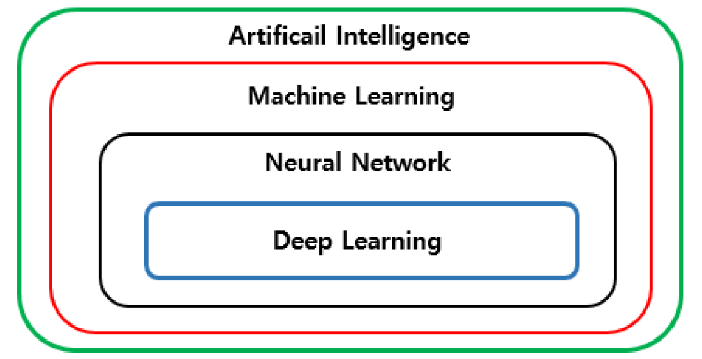

1. 제목 (영어/한글)
- 인공지능의 역사, 분류, 그리고 발전 방향에 관한 연구
- A Study on the History, Classification and Development Direction of Artificail Intelligence
2. 저자/연도/출처
- 조민호/2021/https://koreascience.or.kr/article/JAKO202113254541050.page
3. 연구의 필요성과 목적
- 인공지능에 관련된 중요 개념 정리와 지난 60년의 발전 과정을 요약을 통한 AI 활용 및 연구 방향성 수립의 토대 설정
4. 중요 컨셉 및 내용 요약
- 인공지능 분류

4. 결론 및 시사점(제언)
7. 자신의 프로젝트에 반영할 부분